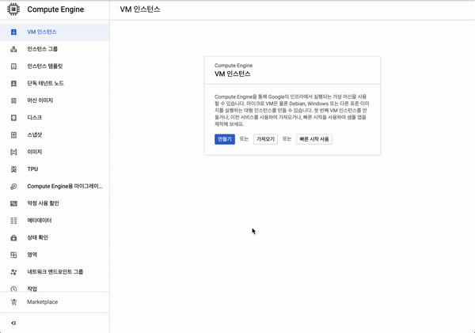

# Harbor-On-GCP

GCP 에 Docker Private Registry 인 Harbor 를 구축해보는 예제 프로젝트

## Instruction

1. [Google Cloud Console](https://console.cloud.google.com) 에 접속

2. 아래의 이미지를 참고하여 CentOS 7 이상의 Compute Engine Instance 를 생성



3. 생성 된 Instance 에 SSH 로 접속 후 아래의 명령어를 실행

```
curl -fsSL https://raw.githubusercontent.com/lutics/Harbor-On-GCP/master/install.sh -o install.sh && chmod +x install.sh
sudo ./install.sh [IP ADDRESS]
```

4. http://[Compute Engine IP주소] 로 접속